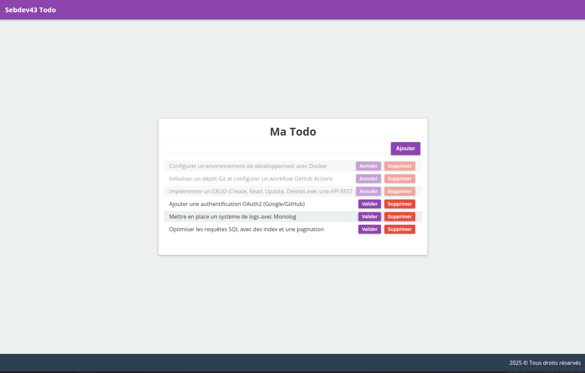

# Todo List PHP

Mon premier projet PHP : une application de gestion de tâches (Todo List)

## 📋 Description

Cette application web permet de gérer une liste de tâches avec les fonctionnalités suivantes :
- Ajouter une nouvelle tâche
- Marquer une tâche comme terminée/non terminée
- Supprimer une tâche

## 🛠️ Technologies utilisées

- PHP 8
- HTML5
- CSS3
- JavaScript
- JSON (pour le stockage des données)

## 🚀 Fonctionnalités

- Interface simple et intuitive
- Validation des données (minimum 5 caractères par tâche)
- Stockage persistant des tâches dans un fichier JSON
- Design responsive
- Sécurisation des entrées utilisateur

## 📁 Structure du projet

```
Todo-PHP/
├── data/
│   └── todos.json         # Stockage des tâches
├── includes/
│   ├── header.php         # En-tête du site
│   ├── footer.php         # Pied de page
│   └── head.php           # Métadonnées HTML
├── public/
│   ├── css/              # Styles CSS
│   └── js/               # Scripts JavaScript
├── index.php             # Page principale
├── edit-todo.php         # Gestion de l'état des tâches
└── remove-todo.php       # Suppression des tâches
```

## 🔧 Installation

1. Cloner le dépôt
2. Placer les fichiers dans un serveur web compatible PHP
3. S'assurer que le dossier `data` a les permissions d'écriture
4. Accéder à l'application via votre navigateur

## 💡 Apprentissages

Ce projet m'a permis d'apprendre :
- Les bases du développement PHP
- La manipulation de fichiers JSON
- La gestion des formulaires
- La validation des données
- Les bonnes pratiques de sécurité basiques
- L'organisation d'un projet web

